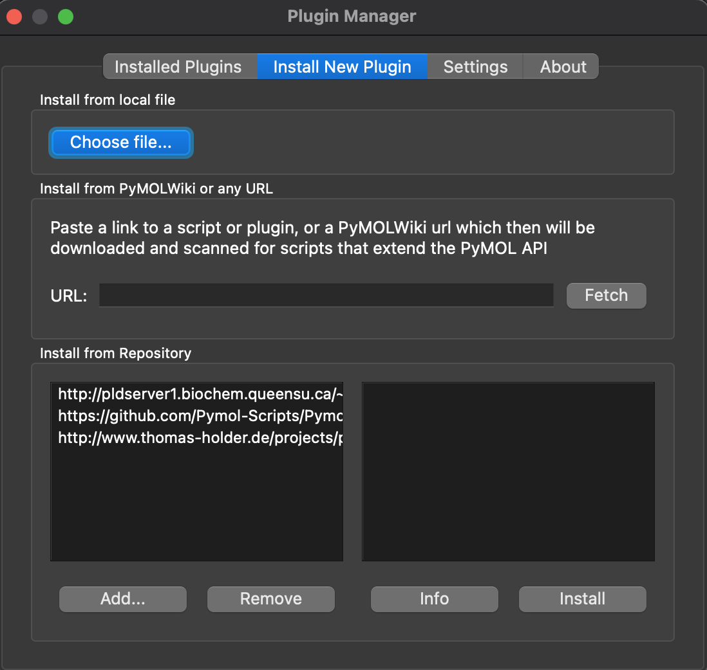
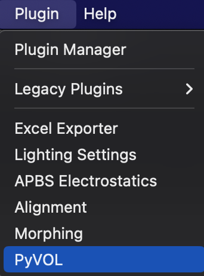
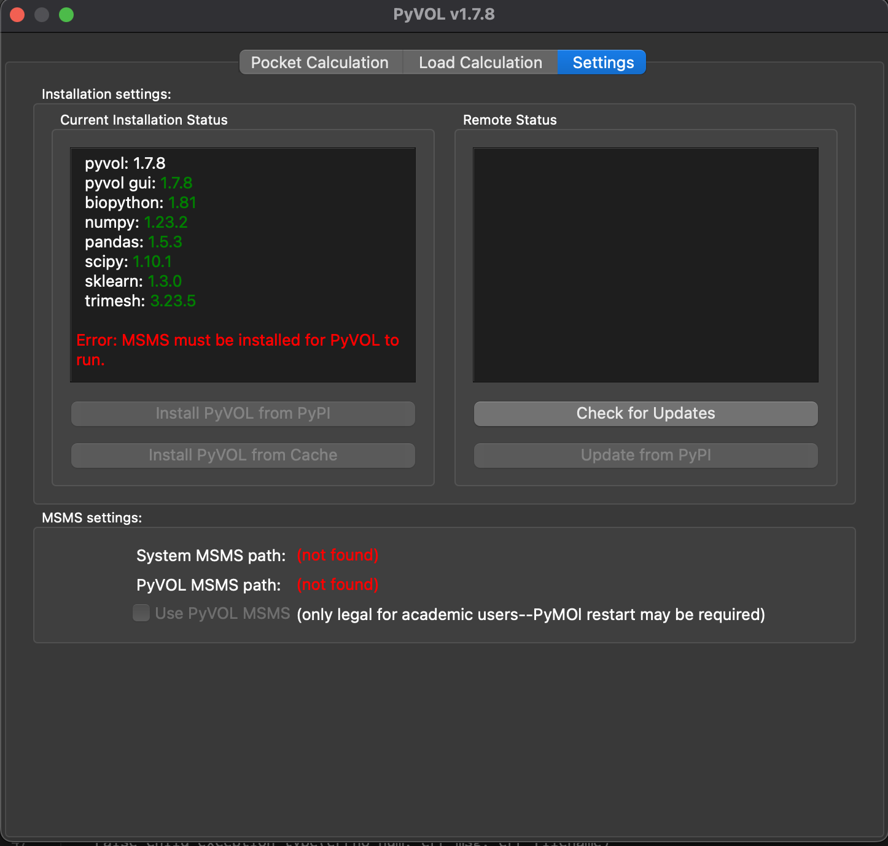
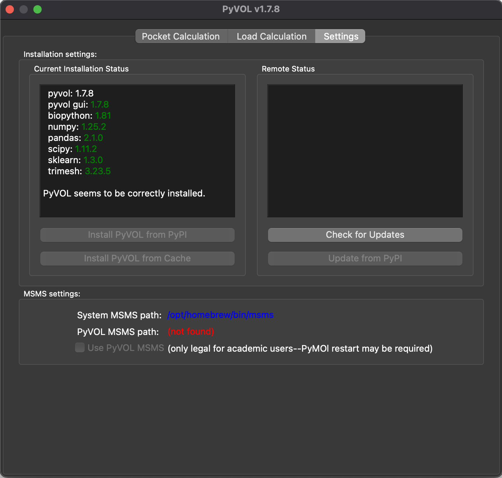
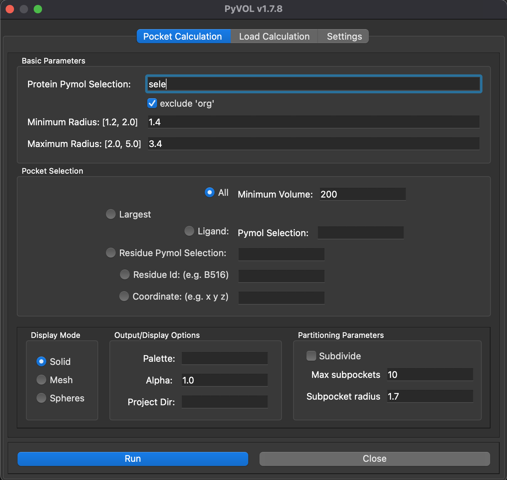

## PyVOL GUIプラグイン
(2023年9月6日更新)

2019年10月24日、[BioRxivにPyMOLプラグインの**PyVOL**というのを開発したよという論文](https://www.biorxiv.org/content/10.1101/816702v1)が投稿されました。


これはタンパク質の中の空隙、つまり基質や薬剤などが入りそうな空間を検出し、体積の値の表示もしてくれるプラグインのようです。ちょっと興味があったのでインストールすることにしてみました。

### 使用可能な環境

- Linux OSまたはmacOS。2021年以降はcatalina以降のmacOSでも使用できるようになりました。

### PyVOLのインストール方法

以下のGitHubにてこのプラグインをメンテナンスしてくれているようです。
[https://github.com/schlessingerlab/pyvol/](https://github.com/schlessingerlab/pyvol/)

1. https://github.com/schlessinger-lab/pyvol/blob/master/installers/pyvol-installer.zip のページにアクセスし、画面右端の↓マークからファイルをダウンロードします（14.6 MB）。
2. PyMOLを開き、画面上部のメニュー`Plugin`から`Plugin Manager`を選択して次の画面を出します。<br>
3. `Choose file...`から先程ダウンロードした`pyvol-installer.zip`を選択します。
4. Select plugin directoryのダイアログが表示されますが、そのまま特に変更せずOKを押します。`Plugin "pyvol_gui" has been installed.`と表示されればOKです。
5. PyMOLの画面上部のメニュー`Plugin`に`PyVOL`が表示されていることを確認します。<br>
6. PyVOL 1.7.8のダイアログが開きます。画面左側の`Install PyVOL from PyPI`をクリックしてしばらく待つと、動作に必要なPythonパッケージが自動的にダウンロードされて次のような画面表示になります（バージョンはその時々で異なるのであまり気にしないでください）。<br>
7. 動作には**MSMS**という実行ファイルを追加でインストールする必要があります。これは https://ccsb.scripps.edu/msms/downloads/ からダウンロードするもので、Linux, macOS, さらにmacOSのうちApple Silicon（いわゆるM1, M2 Macのこと）を使っている方はArm64の方からMSMSをダウンロードします。
8. ここがやや厄介なのですが、PyVOLからMSMSの実行ファイルを呼び出すためにはコマンド名を`msms`としなければ認識してくれません。先程ダウンロードしたMSMSは実行ファイル名が`msms_Arm64_2.6.1`(Apple Silicon製)だったり、`msms.x86_64Darwin.2.6.1`(Intel CPUのMacの場合)だったりします。これを実行できるようにするためには以下のコマンドを打つのが手っ取り早いかもしれません。

```bash
# Apple Silicon Macの場合
ln -sf ~/Downloads/msms_Arm64_2.6.1/msms_Arm64_2.6.1 /opt/homebrew/bin/msms
# Intel Macの場合
ln -sf ~/Downloads/msms_x86_64Darwin_2.6.1/msms.x86_64Darwin.2.6.1 /usr/local/bin/msms
```

ここでやっていることは、先程ダウンロードしたMSMSの実行ファイルのシンボリックリンクファイルを`/opt/homebrew/bin`または`/usr/local/bin`以下に`msms`というコマンド名で配置するということです。そしてこれをやった後にターミナルから`which msms`としてみてnot found と言われなければ使えるようになっているはずです。

PyMOLを**ターミナルから起動して**、PluginメニューからPyVOLを選択した時に、以下のように表示されればOKです。



もしインストールがうまく行っていない場合は、下の"System MSMS path"がnot foundになります。このPyVOLを選択してみて、メニューが開けたら成功です。


### 簡単な使い方

タンパク質を選択しておいてからPyVOLプラグインのParametersタブのRunボタンを押すだけです。Load Pocketのタブでは描画方法を色々変えることもできます。


