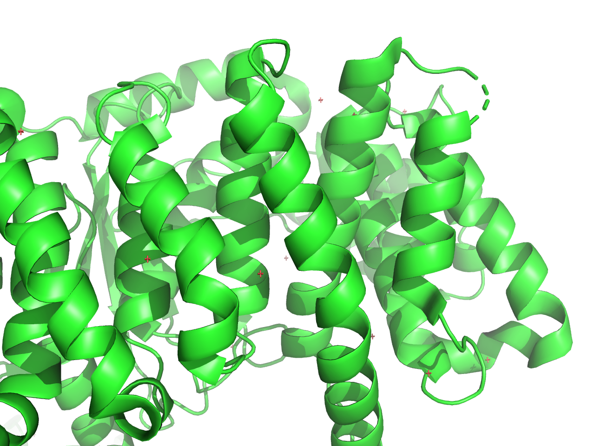
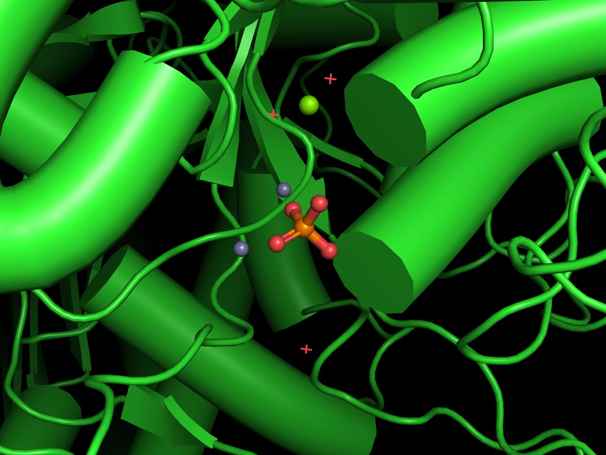
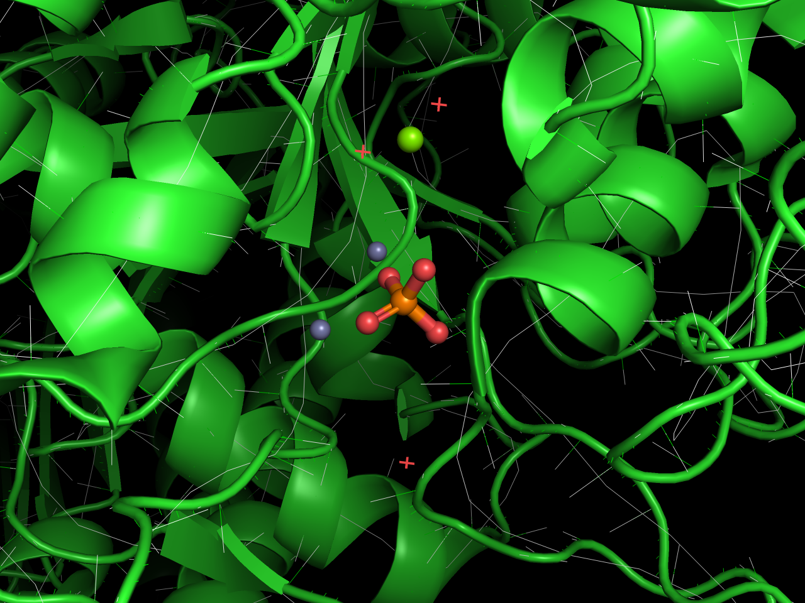
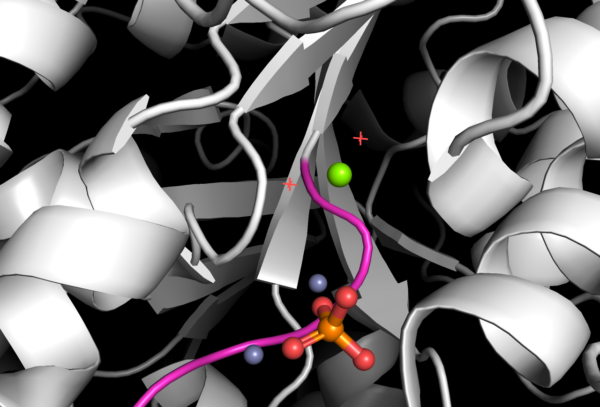
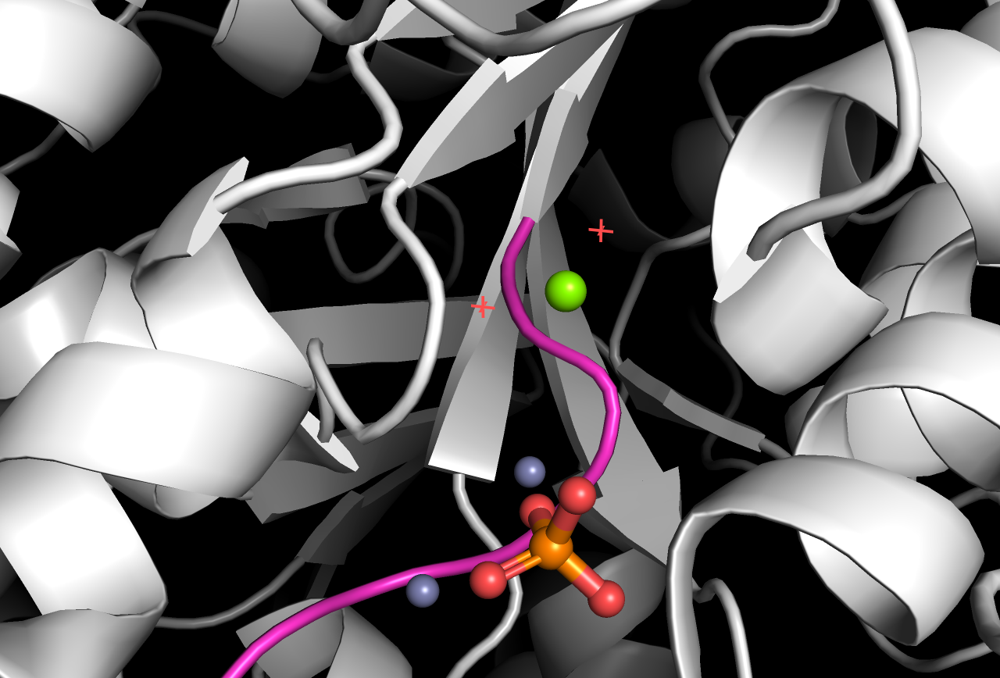
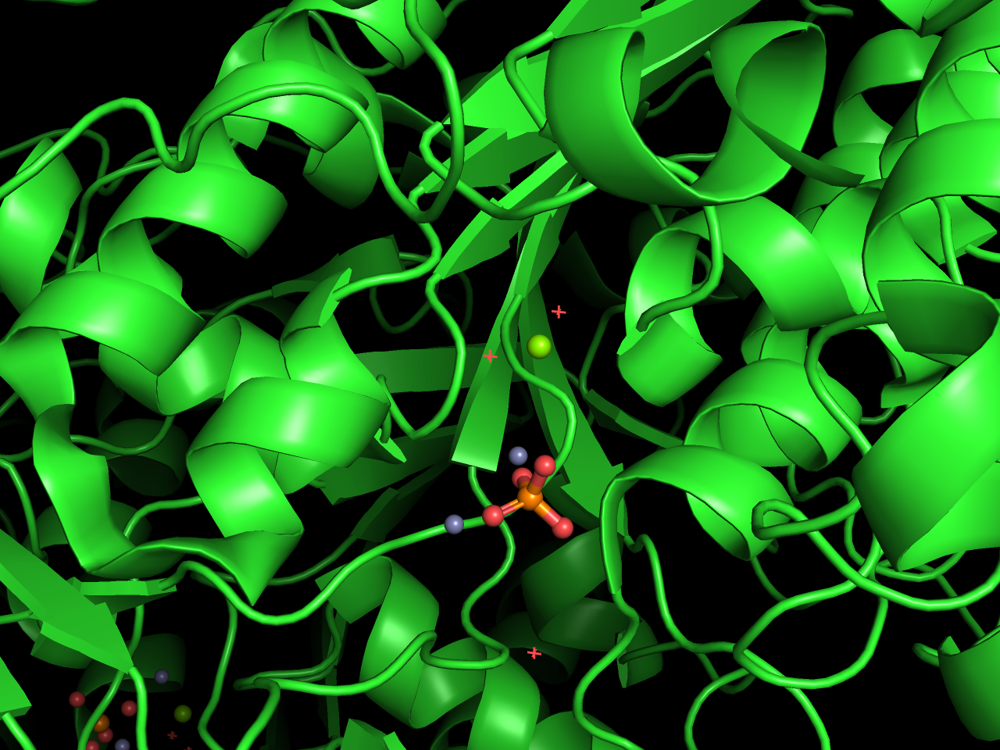
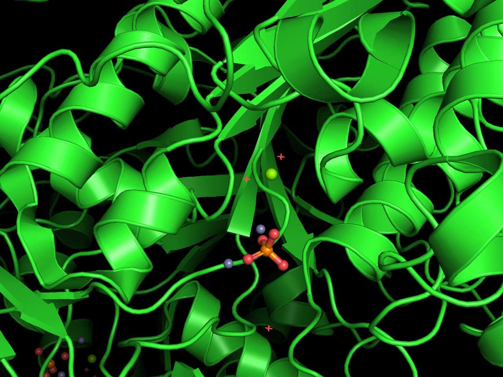
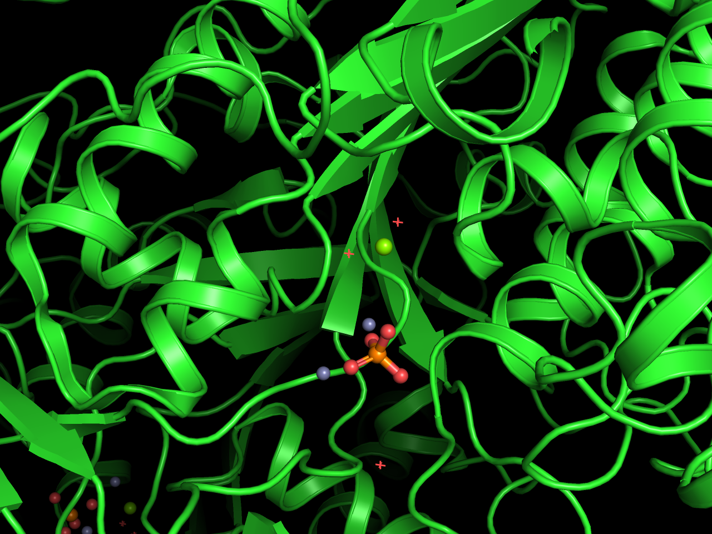
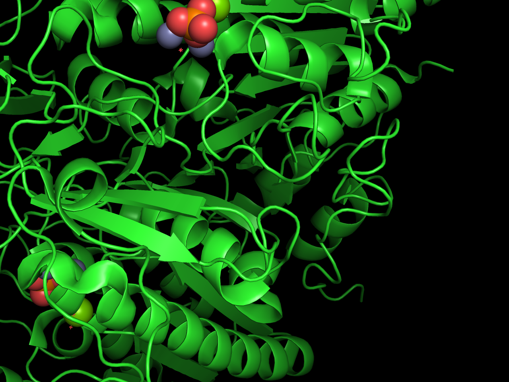

### cartoonの描画

#### cartoon_cylindrical_helices

`cartoon_cylindrical_helices`は、ヘリックスの描画を円筒状にするかどうかを設定する設定値です。デフォルト値は`0`ですが、これを`1`にすることで、ヘリックスの描画を円筒状にすることができます。

```bash
set cartoon_cylindrical_helices, 1
```

|cartoon_cylindrical_helices=0|cartoon_cylindrical_helices=1|
|---|---|
|||

#### cartoon_debug

`cartoon_debug`は、cartoon表示のデバッグ用オプションであり、ユーザー側は利用することはないと思います。デフォルト値は`0`ですが、これを`1`にすることで、Cartoon表示のレンダリング判定が現れるようになります。

```bash
set cartoon_debug, 1
```

|cartoon_debug=0|cartoon_debug=1|
|---|---|
|||

#### cartoon_discrete_colors

`cartoon_discrete_colors`は、カートゥーンの色が隣接する色と混ざらないようにするか、それとも互いに混ざり合うかを切り替える設定値です。デフォルト値は`0`ですが、これを`1`にすることで、カートゥーンの色が隣接する色と混ざらないようになります。Cartoon表示を行っている時に隣り合う残基の色を変えていると違いがわかります。

```bash
set cartoon_discrete_colors, 0 # default, 隣ある色が混ざり合う
set cartoon_discrete_colors, 1 # 隣ある色との混ざり合いが発生しない
```

|cartoon_discrete_colors=0|cartoon_discrete_colors=1|
|---|---|
|||

#### cartoon_fancy_helices

`cartoon_fancy_helices`は、ヘリックスの描画をよりファンシーにするかどうかの設定値です。
Cartoonの表示はdefault, cylindrical, fancyの3種類があります。
fancy helicesモードは、ヘリックスの描画をよりファンシーにすることができます。

```bash
set cartoon_fancy_helices, 1
```

|cartoon_fancy_helices=0|cartoon_fancy_helices=1|
|---|---|
|||

#### cartoon_dumbbell_length

`cartoon_dumbbell_length`は`cartoon_fancy_helices`がONになっているときのみ効果を発揮します。cartoonのヘリックスの描画をどの程度の長さにするかを設定する設定値です。デフォルト値は`1.6`ですが、これを変更することで、cartoonヘリックスの長さを変更することができます。

```bash
# defaultは1.6
set cartoon_dumbbell_length, 0.7
```

|cartoon_dumbbell_length=0.7|cartoon_dumbbell_length=1.6|
|---|---|
|||

#### cartoon_loop_radius

cartoon_loop_radiusは、ループ部分の太さを調整する設定値です。デフォルト値は0.5ですが、これを変更することで、ループ部分の太さを調整することができます。

```bash
# defaultは0.2
set cartoon_loop_radius, 0.1
```

|0.2|0.1|
|---|---|
|||
