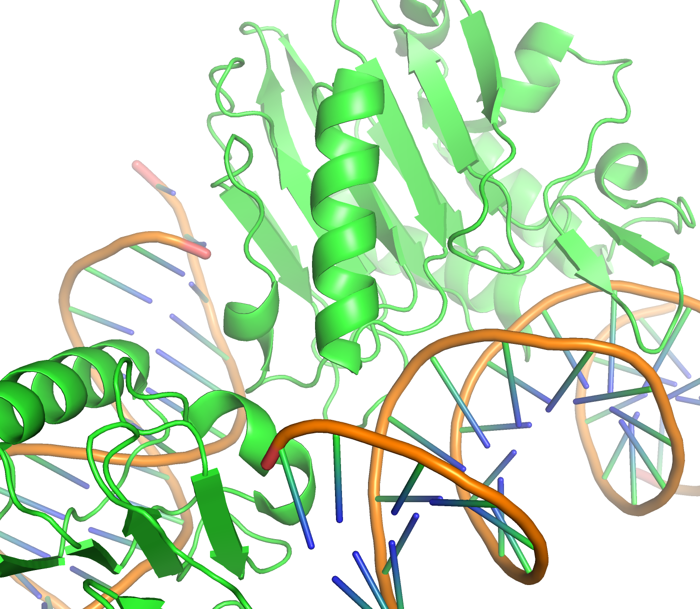
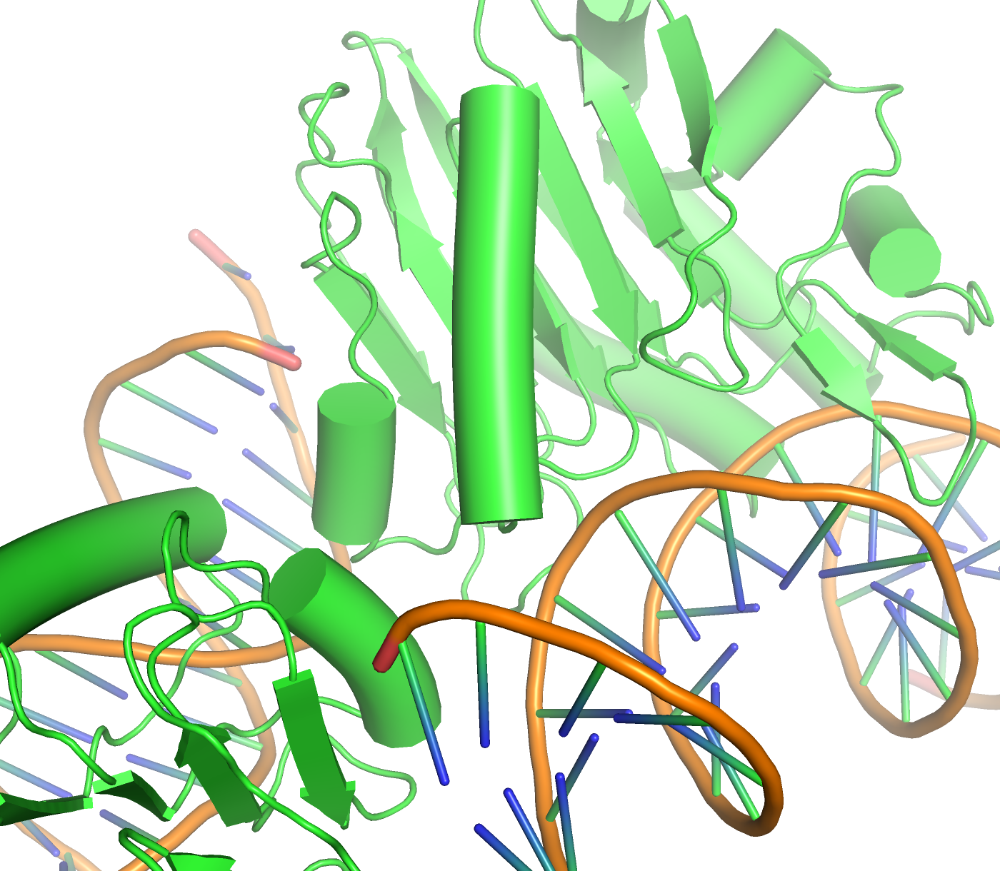
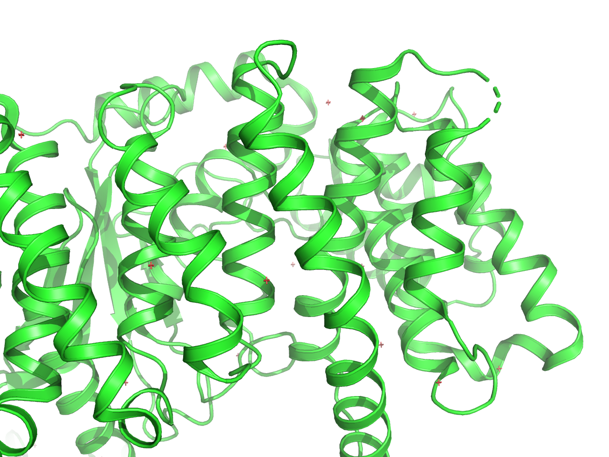
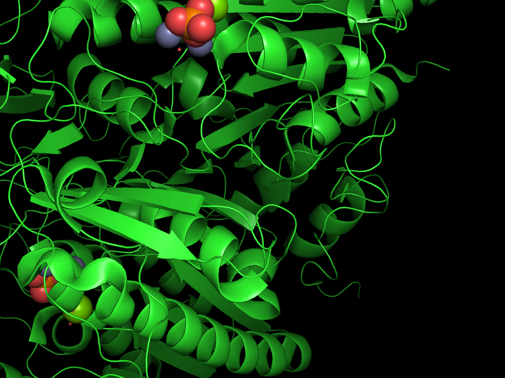
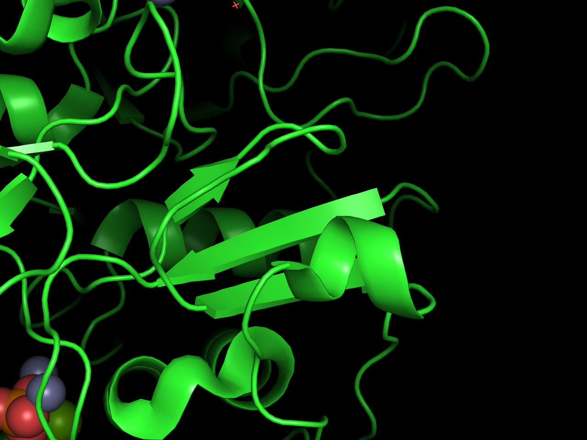

### cartoonの描画

#### cartoon_cylindrical_helices

`cartoon_cylindrical_helices`は、ヘリックスの描画を円筒状にするかどうかを設定する設定値です。デフォルト値は`0`ですが、これを`1`にすることで、ヘリックスの描画を円筒状にすることができます。

```bash
set cartoon_cylindrical_helices, 1
```

|cartoon_cylindrical_helices=0|cartoon_cylindrical_helices=1|
|---|---|
|||

#### cartoon_debug

`cartoon_debug`は、cartoon表示のデバッグ用オプションであり、ユーザー側は利用することはないと思います。デフォルト値は`0`ですが、これを`1`にすることで、Cartoon表示のレンダリング判定が現れるようになります。

```bash
set cartoon_debug, 1
```

|cartoon_debug=0|cartoon_debug=1|
|---|---|
|||

#### cartoon_discrete_colors

`cartoon_discrete_colors`は、カートゥーンの色が隣接する色と混ざらないようにするか、それとも互いに混ざり合うかを切り替える設定値です。デフォルト値は`0`ですが、これを`1`にすることで、カートゥーンの色が隣接する色と混ざらないようになります。Cartoon表示を行っている時に隣り合う残基の色を変えていると違いがわかります。

```bash
set cartoon_discrete_colors, 0 # default, 隣ある色が混ざり合う
set cartoon_discrete_colors, 1 # 隣ある色との混ざり合いが発生しない
```

|cartoon_discrete_colors=0|cartoon_discrete_colors=1|
|---|---|
|||

#### cartoon_fancy_helices

`cartoon_fancy_helices`は、ヘリックスの描画をよりファンシーにするかどうかの設定値です。
Cartoonの表示はdefault, cylindrical, fancyの3種類があります。
fancy helicesモードは、ヘリックスの描画をよりファンシーにすることができます。

```bash
set cartoon_fancy_helices, 1
```

|cartoon_fancy_helices=0|cartoon_fancy_helices=1|
|---|---|
|||

#### cartoon_dumbbell_length

`cartoon_dumbbell_length`は`cartoon_fancy_helices`がONになっているときのみ効果を発揮します。cartoonのヘリックスの描画をどの程度の長さにするかを設定する設定値です。デフォルト値は`1.6`ですが、これを変更することで、cartoonヘリックスの長さを変更することができます。

```bash
# defaultは1.6
set cartoon_dumbbell_length, 0.7
```

|cartoon_dumbbell_length=0.7|cartoon_dumbbell_length=1.6|
|---|---|
|||

#### cartoon_dumbbell_radius

`cartoon_dumbell_radius`は、`cartoon_fancy_helices`がONになっているときのみ効果を発揮します。dumbbellの半径を設定する設定値です。
この値を0.1に設定すると、デフォルトの設定でdumbbellの形状が消えますが、0.1未満に設定すると、fancy helixの内部空間が表示されます。

```bash
# default は0.16
set cartoon_dumbbell_radius, 0.1
```

|cartoon_dumbell_radius=0.1|cartoon_dumbell_radius=0.16|cartoon_dumbell_radius=0.4|
|---|---|---|
||||

#### cartoon_loop_width

`cartoon_loop_width`は、`cartoon_fancy_helices`がONになっているときのみ効果を発揮します。ループ部分の太さを設定する設定値です。

```bash
set cartoon_dumbbell_width, 0.1 # defaultは0.17
```

|cartoon_loop_width=0.17|cartoon_loop_width=0.3|cartoon_loop_width=0.8|
|---|---|---|
||||

#### cartoon_loop_radius

cartoon_loop_radiusは、ループ部分の太さを調整する設定値です。デフォルト値は0.2ですが、これを変更することで、ループ部分の太さを調整することができます。

```bash
# defaultは0.2
set cartoon_loop_radius, 0.1
```

|0.2|0.1|
|---|---|
|||

#### cartoon_fancy_sheets

`cartoon_fancy_sheets`は、シートの終端に矢印を表示するかどうかを設定する設定値です。デフォルト値は`1`ですが、これを`0`にすることで、シートの終端に矢印を表示しないようにすることができます。

```bash
set cartoon_fancy_sheets, 0 # defaultは1, on
```

|cartoon_fancy_sheets=0|cartoon_fancy_sheets=1|
|---|---|
|||

#### cartoon_flat_cycles

`cartoon_flat_cycles`は、シートの平坦度を定義することができる設定値です。値が大きいほど、シートが平坦になります。

```bash
set cartoon_flat_cycles, 1 # defaultは4
```

|cartoon_flat_cycles=0|cartoon_flat_cycles=4|cartoon_flat_cycles=10|
|---|---|---|
||||

#### cartoon_flat_sheets

`cartoon_flat_sheets`は、PyMoLがβシートを描画する際の滑らかさを決定します。平坦なシートは、美しい芸術的な画像を作り出しますが、時にはスティックがシートに接続されているように見える問題が発生することがあります。この問題が発生した場合は、このオプションをオフにしてください。

```bash
set cartoon_flat_sheets, 0 # defaultは1, on
```

|cartoon_flat_sheets=0|cartoon_flat_sheets=1|
|---|---|
|||

#### cartoon_gap_cutoff

`cartoon_gap_cutoff`は、タンパク質主鎖に沿って欠落した残基（例：座標の決定されていないミッシングループ）が存在するとき、ギャップ（残基数）がカットオフよりも短い場合は、点線のCartoonループセグメントを作成します。デフォルトは`10`ですので、10残基よりも短い場合は、点線のCartoonループセグメントを作成します。
この機能はPyMOL 1.8.2から追加されました。

```bash
set cartoon_gap_cutoff, 0 # defaultは10
```

|cartoon_gap_cutoff=0|cartoon_gap_cutoff=10|
|---|---|
|||

#### cartoon_helix_radius

このオプションはヘリックス描画が`set cartoon_cylindrical_helices, 1`となっている場合に有効です。`cartoon_helix_radius`は、ヘリックスを円筒状に描画する際の半径を設定する設定値です。

```bash
set cartoon_cylindrical_helices, 1 # cylinder helixをONにする
set cartoon_helix_radius, 1.0 # defaultは2.25
```

|cartoon_helix_radius=1.0|cartoon_helix_radius=2.25|
|---|---|
|||
