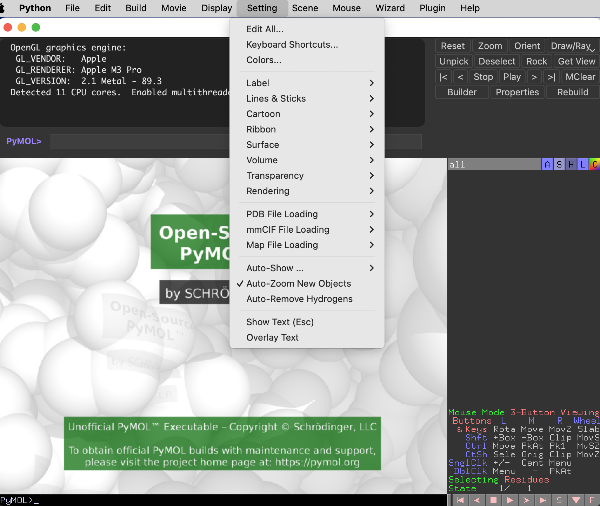
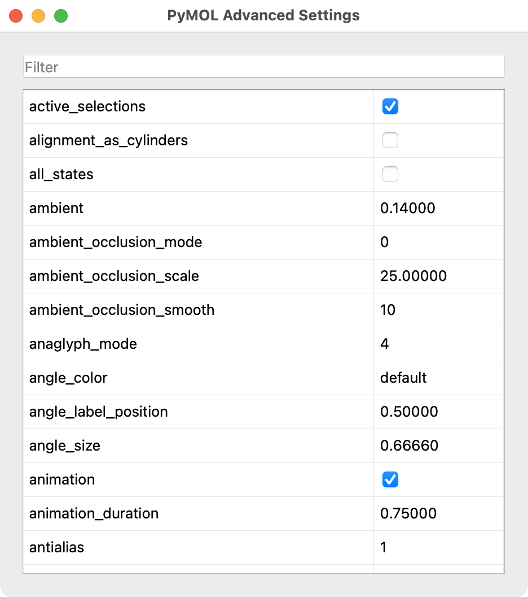
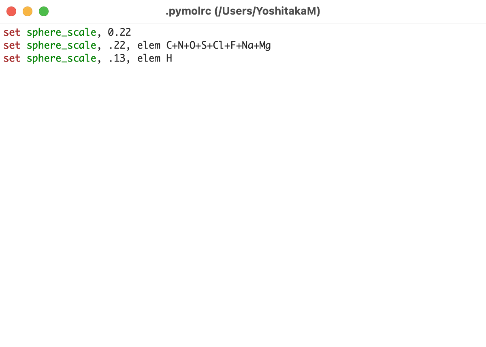

## 描画関連

PyMOLの設定値で一番気になるのは、きれいな生体分子の画像を生成するにはどうすればよいかというところの部分でしょう。PyMOLは、デフォルトの設定値で十分にきれいな画像を生成することができますが、設定値を変更することでさらに美しい画像を生成することができます。この章では、PyMOLの設定値を変更することで、より美しい画像を生成する方法を説明します。

### 概論

PyMOLの設定値を変更する方法は、大きく分けて2つあります。一つは、GUIを使って設定値を変更する方法、もう一つは、コマンドラインを使って設定値を変更する方法です。前者は、PyMOL GUIの[setting]メニューから設定値を変更する方法です。



こちらの[Edit All]をクリックすると、全設定値の表示とその値の変更が可能です。



これには描画関連だけでなく様々な設定値が表示されます。設定値を変更すると、その変更がすぐに反映されます。

CUIでは、`set`コマンドを使って設定値を変更することができます。例えば、`set ray_trace_mode, 3`とすることで、ray_trace_modeの値を3に変更することができます。

```bash
set ray_trace_mode, 3
```

この値は、macOSやLinuxでは各自のホームディレクトリの`~/.pymolrc`に保存することで、この設定値がデフォルトになるように指定することができます。このファイルは、[File]→[Edit pymolrc]をクリックすることで編集することも可能です。



PyMOL起動後にこのファイルに書かれている値で上書きすることで、設定値を変更することを実現しています。

設定値は、CUIにおいて`get`コマンドを使って確認することができます。

```bash
get sphere_scale
```

結果

```bash
PyMOL>get sphere_scale,
 get: sphere_scale = 1.00000
```

### sphereの大きさを変更

デフォルトのsphere表示は原子の体積をスケールを表現するように表現されています。一方で、原子の点をもう少し小さく表現させることも可能です。

```bash
set sphere_scale, 0.25
```

このコマンドを実行することで、sphereの大きさを0.25倍に変更することができます。

<video width="100%" height="100%" controls autoplay loop>
<source src="./image/movie1.mp4" type="video/mp4">
</video>

実際には水素原子をやや小さめに描画する方がもっともらしくなるので、私は以下のような設定値を使っています。

```bash
set sphere_scale, 0.22
set sphere_scale, 0.22, elem C+N+O+S+Cl+F+Na+Mg
set sphere_scale, 0.13, elem H
```
