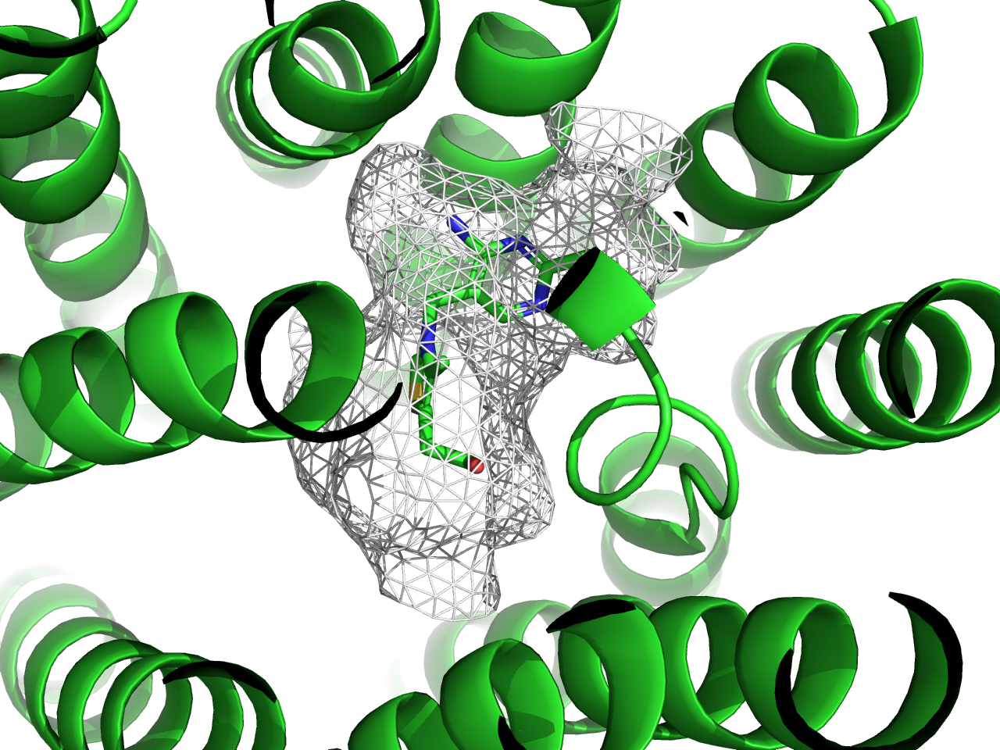
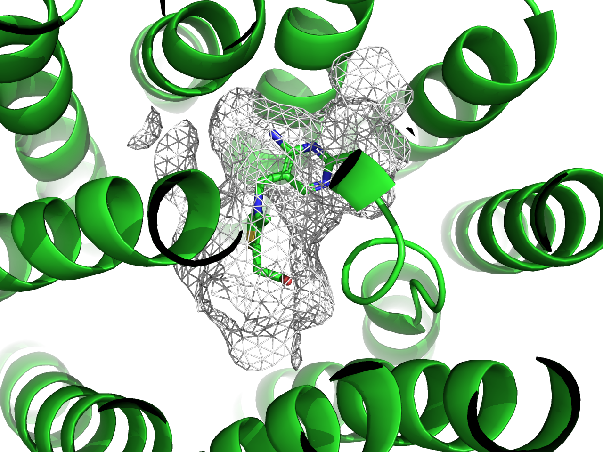
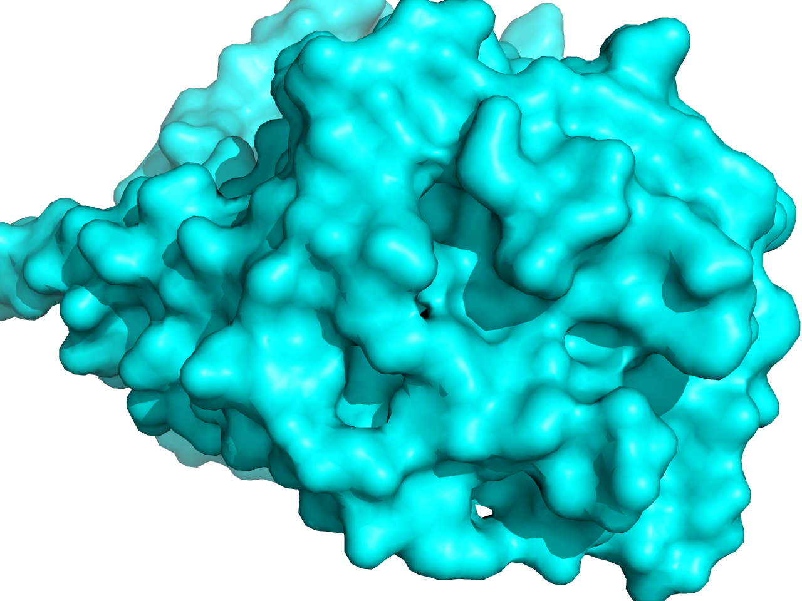
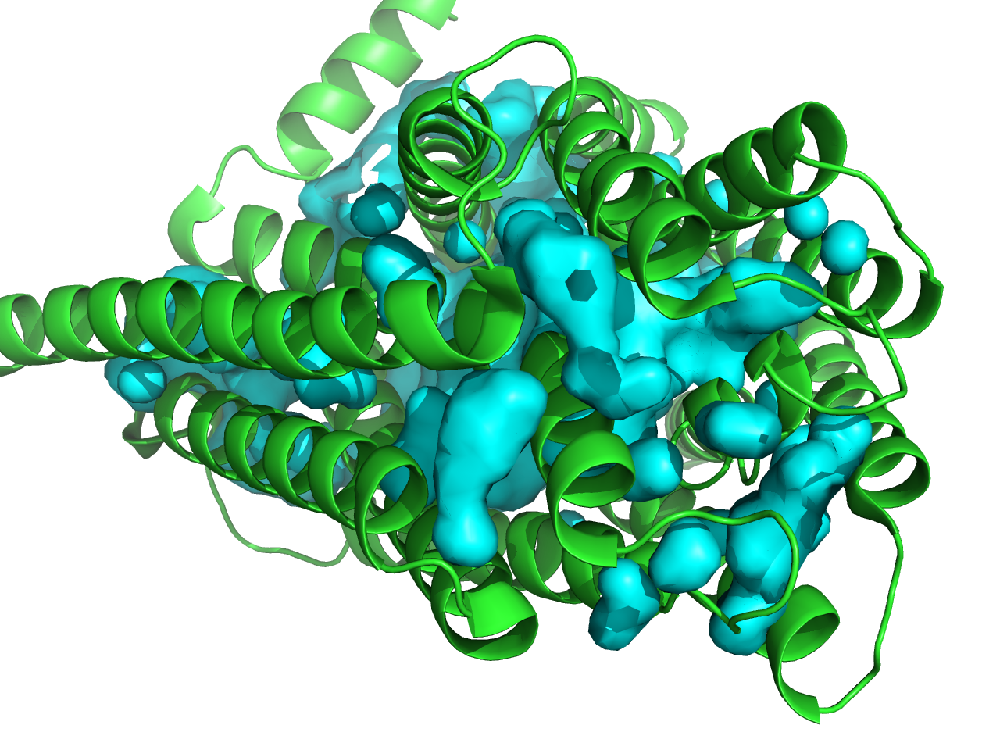
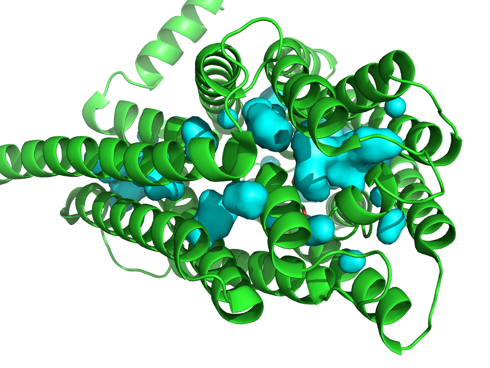

## surface描画関連

### surface_best

> **surface_best** (float, default: 0.25) is a tuning parameter that should not need to be modified.

一応設定値として存在していますが、通常は変更する必要はありません。

### surface_carve_selection

> (string, default: blank) is the named selection of atoms about which the surface is carved.

`surface_carve_selection`と`surface_carve_cutoff`の設定により、分子表面の描画を原子選択の近傍に制限することができます。原子のサブセットに対してのみsurface表現を表示する場合とは異なり、描画は原子レベルではなく頂点（surface point）レベルで制御されます。

`surface_carve_selection`の値は（`select`で作成した）named selectionオブジェクトでなければなりません。つまり、`chain A`のような選択式は使うことができません。

以下に、`surface_carve_selection`を使ってsurfaceを描画したときと、使わずに`show surface`で描画したときの違いを示します。

`surface_carve_selection`でリガンド周辺の5 Å以内の原子を選択し、`surface_carve_cutoff`を5.0に設定してsurfaceを描画したとき。こちらは頂点 (surface point) レベルで描画が制御されます。

```shell
# PDB ID: 8z7zのロード
fetch 8z7z, async=0
# リガンド分子(VIB)をcarveseleオブジェクトとして選択
select carvesele, organic
# リガンド周辺の5 Å以内の原子をsurface_carve_selectionで選択
set surface_carve_selection, carvesele
set surface_carve_cutoff, 5
# surfaceを描画
show surface
# 見た目の調整
# mesh表示
set surface_type, 2
set surface_color, white
bg_color white
ray
```



使用しない場合。こちらは原子レベルで描画が制御されます。

```shell
# PDB ID: 8z7zのロード
fetch 8z7z, async=0
# リガンド分子(VIB)をcarveseleオブジェクトとして選択
select carvesele, organic
show surface, all within 5 of carvesele
# mesh表示
set surface_type, 2
set surface_color, white
bg_color white
ray
```



`surface_carve_selection`を使うほうが、5Å近傍の表面をより正確に表現できている感じがします（ちょっとこの例だとわかりにくいかもしれませんが……）。

### surface_carve_cutoff

> **surface_carve_cutoff** (float, default: 0.0) controls the cutoff distance from `surface_carve_selection` atoms which surface points must meet to be included in the carved surface.

`surface_carve_selection`で選択された原子からの距離がこの値よりも大きい場合、その点は刻んで彫り取った表面に含まれません。

### surface_carve_normal_cutoff

> (float, default: -1.0) controls the dot product threshold from `surface_carve_selection` atoms which surface points must meet to be included in the carved surface.

carveされた表面の法線ベクトルと`surface_carve_selection`で選択された原子との間の角度がこの値よりも小さい場合、その点は彫り取った表面に含まれません。

### surface_carve_state

> (integer, default: 0) is the controlling state for surface carving. By default, the corresponding coordinate set state is used.

### surface_cavity_mode

`surface_cavity_mode`はPyMOLのcavity描画方法を変更します。通常`0`または`1`です。デフォルトは`0`で、全体のcavityを描画します。`1`に設定すると、反転したcavityを描画します。タンパク質のリガンドが入るような空隙を描画する際に便利です。

```shell
set surface_cavity_mode, 1
```

以下の図ではわかりやすさのため`surface_color`を`cyan`に設定しています。

|surface_cavity_mode=0|surface_cavity_mode=1|
|---|---|
|||

### surface_cavity_cutoff

> (float, default: 0.0) controls the cutoff distance from `surface_carve_selection` atoms which surface points must meet to be included in the carved surface.

`surface_cavity_cutoff`は`surface_carve_selection`で選択された原子からの距離がこの値よりも大きい場合、その点は刻んで彫り取った表面に含まれません。

### surface_cavity_radius

surface表示をしたときのcavityの半径を設定します。デフォルトは`7.0`です。`surface_cavity_mode`が`1`のときに有効のようです。

|surface_cavity_radius=3.0|surface_cavity_radius=7.0|
|---|---|
|||

### surface_circumscribe

### surface_clear_cutoff

### surface_clear_selection

### surface_clear_state

### surface_color

### surface_color_smoothing

### surface_color_smoothing_threshold

### surface_debug

### surface_miserable

### surface_mode

### surface_negative_color

### surface_negative_visible

### surface_normal

### surface_optimize_subsets

### surface_poor

### surface_proximity

### surface_quality

### surface_ramp_above_mode

### surface_residue_cutoff

### surface_smooth_edges

### surface_solvent

### surface_trim_cutoff

### surface_trim_factor

### surface_type

### surface_use_shader
